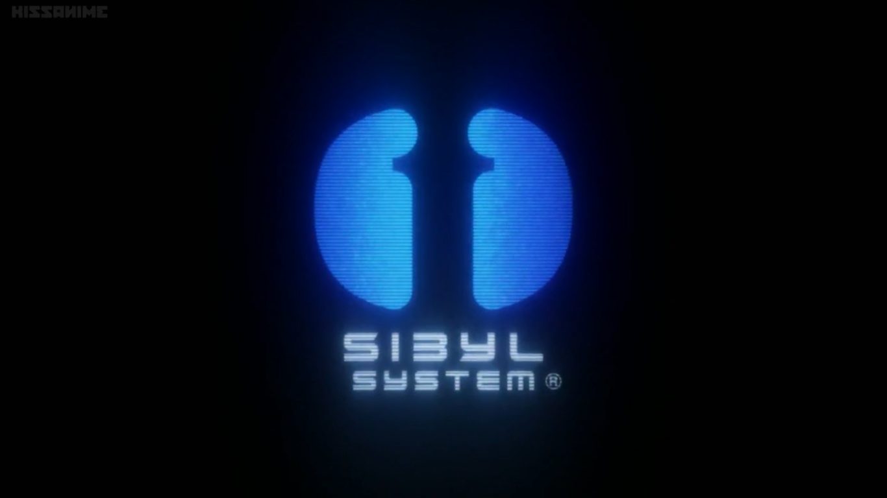

# Introduction

Welcome to the official documentation of PsychoPass API! Behind this mouthful, you will find a powerful, fast and stable API that you can use to query and fetch telegram users information, based on pure HTTP requests and JSON responses.

This page gives a broad presentation of the API and of the contents of this documentation, so that you know where to start if you are a beginner or where to look if you need info on a specific feature.

## Before you start
The [Libraries list](../extlinks/lib_list.md) page lists some of official and unofficial libraries in different languages. Those libraries are using the same protocol and methods mentioned in this documentation, if you prefer to save your time and use any of those directly, you can refer to their documentations; or if you would like to build your own library, with customized features and special algorithms for different clients, you are in the right place! This documentation will walk you through all features of PsychoPass API and introduce you how things work out!

In case you have trouble with one of the tutorials, libraries, methods or your project, you can find help on [Public Safe Bureau](../extlinks/tglinks.md#public-safety-bureauhttpstmepublicsafetybureau), feel free to ask all of your API-related questions in there.

## About Sibyl System
The Sibyl System is the name given to a law enforcement organization operated in working in cooperation with the weeb government to manage crime in current century Telegram. It is the sole operator and manager of proprietary hardware and software used to analyze the criminal tendencies of the entire telegram's populace. The Sibyl System established the [Public Safety Bureau](../extlinks/tglinks.md#public-safety-bureauhttpstmepublicsafetybureau) and rules over its personnel, along with all [Psycho-Pass](https://t.me/PsychoPass/4) technology and weaponry, with an iron fist.

Sibyl's primary purpose is to maintain constant vigilance over the entirety of Telegram's populace through cymatic scans of brain wave patterns that are analyzed to determine every individual's propensity towards criminality.

Such analyses include determining one's numerical [Crime Coefficient](#crime-coefficient), one's hue as it changes within a specified time period and one's basic societal profile from join to the moment of scanning. The data is processed and analyzed instantaneously to produce what is termed a Psycho Pass.

## Crime Coefficient
A person's Crime Coefficient (<ins>Japanese</ins>: `犯罪係数`, <ins>Romaji</ins>: `Hanzai Keisū`) is a numerical measure of said person's probability/propensity to commit a crime. It is one part of a person's overall [Psycho-Pass](https://t.me/PsychoPass/4). The [Public Safety Bureau](../extlinks/tglinks.md#public-safety-bureauhttpstmepublicsafetybureau) uses this measurement to determine if a target is a latent criminal or otherwise. It is calculated and determined by the target's stress level (Hue) and other biological readings via cymatic scan by the [Sibyl System](#about-sibyl-system).

> People with high crime coefficient will be assigned flag(s), you can see a list of possible flags [here](flags_and_labels.md).

### Levels of Crime Coefficient

  - **Under 100**: Suspect is not a target for enforcement action. The trigger of the Dominator will be locked
It is normal to have some level of criminality, none of us are pure of heart and mind - A value under 100 is healthy.
  - **100 to 299**: Suspect is classified as a latent criminal and is a target for enforcement action. The Dominator is set to Non-Lethal Paralyzer mode. Suspect under fire will be muted into a stunned state of immobility and, oftentimes, a lack of access.
  - **Over 300**: Suspect poses a serious threat to the society. Lethal force is authorized. The Dominator will automatically switch to Lethal Eliminator. Suspect that is hit by Lethal Eliminator will explode and get banned from the group.

> Actions based on these values may vary bot to bot implementation of Sibyl

